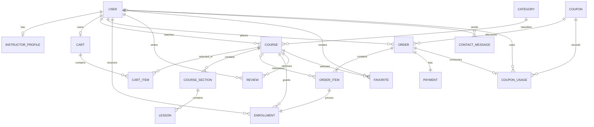

# معماری، ERD و تفسیر Joinها

## تصمیم معماری

پروژه به‌صورت Monolith ماژولار پیاده‌سازی شده است: Django قالب‌ها و صفحات را رندر می‌کند و Django Ninja APIهای تعاملی را ارائه می‌دهد. این ساختار برای پروژه دانشگاهی هم قابل‌فهم است و هم جداسازی مسئولیت مناسبی دارد.

```text
Browser
   ├── Django Templates (GET pages)
   └── Django Ninja JSON APIs (POST/PATCH/DELETE)
                 │
             Services
                 │
             Django ORM
                 │
              SQLite
```

## ERD خلاصه



## جدول‌ها و دلیل ارتباط‌ها

### User و InstructorProfile — One-to-One

اطلاعات پایه مانند ایمیل و رمز برای همه کاربران مشترک است؛ عنوان تخصصی و رزومه فقط برای مدرس لازم است. جداکردن پروفایل مدرس مانع از پرشدن جدول User با ستون‌های Null می‌شود.

### Category و Course — One-to-Many با PROTECT

هر دوره یک دسته دارد و هر دسته چند دوره. `PROTECT` اجازه نمی‌دهد دسته‌ای که دوره دارد تصادفی حذف شود.

### User و Course — One-to-Many با نقش مدرس

هر دوره یک مدرس اصلی دارد و یک مدرس می‌تواند چند دوره داشته باشد. این Join برای پنل مدرس استفاده می‌شود:

```python
Course.objects.filter(instructor=request.user)
```

### Course، CourseSection و Lesson

رابطه سلسله‌مراتبی دوره ← فصل ← درس است. برای ترتیب، ستون `order` داریم و Constraint مانع دو فصل با ترتیب یکسان در یک دوره می‌شود.

### User و Cart — One-to-One

هر کاربر فقط یک سبد فعال دارد. این تصمیم Query را ساده می‌کند و از چند سبد موازی و مبهم جلوگیری می‌کند.

### Cart و Course — Many-to-Many از طریق CartItem

یک سبد چند دوره و یک دوره می‌تواند در سبد چند کاربر باشد. جدول واسط `CartItem` زمان افزودن را ذخیره می‌کند و Constraint `(cart, course)` جلوی تکرار را می‌گیرد.

### User و Order — One-to-Many با PROTECT

یک کاربر چند سفارش دارد. `PROTECT` از حذف کاربری که سابقه مالی دارد جلوگیری می‌کند تا گزارش فروش قابل استناد بماند.

### Order و Course — Many-to-Many از طریق OrderItem

`OrderItem` فقط یک جدول واسط ساده نیست؛ Snapshot مالی است و این موارد را نگه می‌دارد:

- `course_code`
- `course_title`
- `unit_price`

اگر مدیر بعداً عنوان یا قیمت Course را تغییر دهد، فاکتور قبلی تغییر نمی‌کند. Foreign Key دوره `SET_NULL` است تا حتی در صورت حذف منطقی/فنی دوره، ردیف مالی باقی بماند.

### Order و Payment — One-to-One

در این پروژه هر سفارش یک پرداخت شبیه‌سازی‌شده دارد. جداسازی Payment از Order باعث می‌شود وضعیت، کد پیگیری، درگاه و زمان پرداخت مستقل و قابل توسعه باشند.

### User و Course — Many-to-Many از طریق Enrollment

Enrollment اثبات دسترسی آموزشی است. علاوه بر User و Course، به `OrderItem` متصل است تا مشخص باشد دسترسی دقیقاً از کدام خرید صادر شده است. Constraint `(user, course)` خرید تکراری را در سطح دیتابیس نیز محدود می‌کند.

### User و Course — Many-to-Many از طریق Review و Favorite

Review امتیاز، متن و وضعیت تأیید را نگه می‌دارد. Favorite فقط انتخاب کاربر است. هر دو UniqueConstraint دارند تا یک کاربر برای یک دوره ردیف تکراری نسازد.

## نمونه Joinهای مهم در ORM

### سفارش‌ها همراه مشتری و ردیف‌ها

```python
Order.objects.select_related("user", "payment").prefetch_related("items")
```

- `select_related` برای ForeignKey و OneToOne از SQL JOIN استفاده می‌کند.
- `prefetch_related` برای مجموعه چندردیفی Query جدا و ادغام در Python انجام می‌دهد.

### دوره‌ها همراه دسته و مدرس

```python
Course.objects.select_related("category", "instructor")
```

### دوره‌های پرفروش

```python
Course.objects.annotate(
    sales=Count("order_items", filter=Q(order_items__order__status="PAID"))
).order_by("-sales")
```

مسیر Join مفهومی:

```text
Course -> OrderItem -> Order(status=PAID)
```

### تعداد دانشجویان هر مدرس

```text
User(INSTRUCTOR) -> Course -> Enrollment -> User(STUDENT)
```

## تراکنش و جلوگیری از Race Condition

ایجاد سفارش و پرداخت با `transaction.atomic` انجام می‌شود. سبد و سفارش با `select_for_update` قفل می‌شوند تا دو درخواست هم‌زمان نتوانند یک سبد را دو بار Checkout کنند.

## تفکیک وضعیت سفارش و پرداخت

Order وضعیت کسب‌وکار را نگه می‌دارد (`PENDING`, `PAID`, `CANCELLED`, `REFUNDED`) و Payment وضعیت عملیات پرداخت را (`INITIATED`, `SUCCESS`, `FAILED`). این تفکیک باعث می‌شود توسعه درگاه واقعی در آینده ساده باشد.
